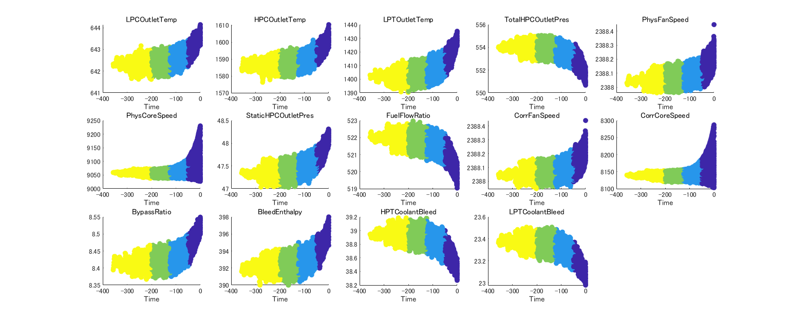
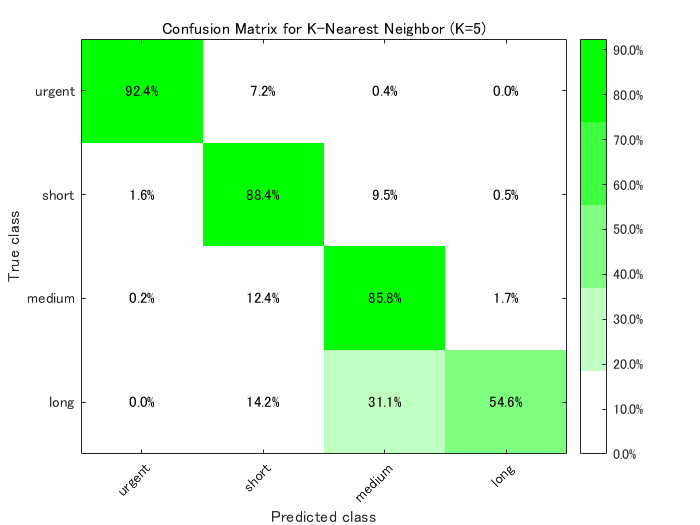
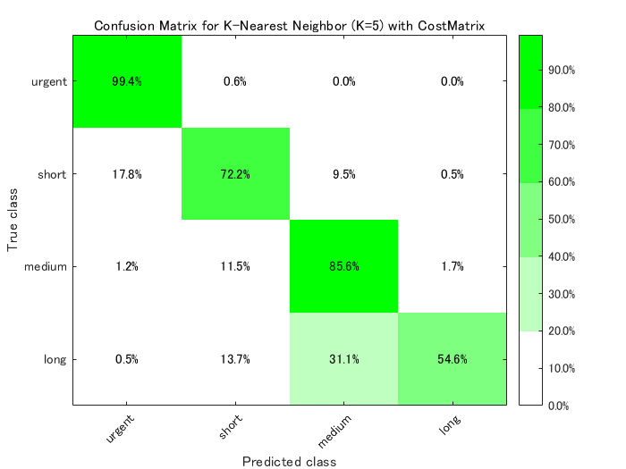
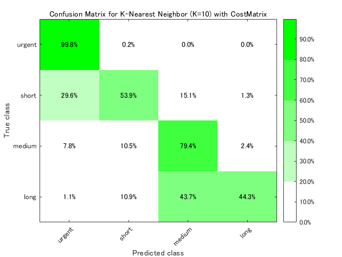

# Data Analytics for predictive maintenance


多変数の時系列データを複数使用します。それぞれの時系列データはそれぞれ同じ型ですが、別々のエンジンで計測しされたものです。 通常エンジンにはユーザーにはわからない様々なレベルの摩耗、製造変動が初期段階から存在しますが、故障しているわけではありません。 エンジンの性能に大きな影響を与える３つの稼動モードがあり、データには稼動モードの情報も含まれています。 データには計測ノイズもあります。時系列データの初めではエンジンは正常に機能しており、どこかのタイミングで劣化し始めます。 事前に定めた、それ以上は正常に稼働させるのは望ましくないとするしきい値までその劣化は悪化します。 このデモではエンジンが故障するまであと何サイクル正常に稼働するかを予測します。


Copyright 2016-2021 The MathWorks, Inc.


# データの読み込み

```matlab:Code
load('classificationData')
```


fullDataset.Time (残りサイクル数）に応じて４つのカテゴリ分まます。


   \item{      0 \textasciitilde{}   50 cycles : urgent }
   \item{    51 \textasciitilde{} 125 cycles : short }
   \item{  126 \textasciitilde{} 200 cycles : medium }
   \item{  201 \textasciitilde{}        cycles : long }


```matlab:Code
catThreshold = [50,125,200];   
orderedCategory = {'urgent','short','medium','long'};

numCategory = 1:length(catThreshold)+1;
fullDataset.TTF = ones(height(fullDataset),1);
fullDataset.TTF(fullDataset.Time<=-catThreshold(1)) = 2;
fullDataset.TTF(fullDataset.Time<=-catThreshold(2)) = 3;
fullDataset.TTF(fullDataset.Time<=-catThreshold(3)) = 4;
fullDataset.TTF = categorical(fullDataset.TTF,numCategory,orderedCategory,'Ordinal',true);
```


'urgent','short','medium','long' 各カテゴリの度数分布を確認


```matlab:Code
disp('Frequency Distribution :'); tabulate(fullDataset.TTF)
```


```text:Output
Frequency Distribution :
   Value    Count   Percent
  urgent     5000     24.71%
   short     7499     37.07%
  medium     5903     29.18%
    long     1829      9.04%
```


センサーデータのみを抽出（単位・時刻データ以外）


```matlab:Code
sensorData = fullDataset(:,3:end);
```

# センサーデータをカテゴリごとに色分けして表示

```matlab:Code
figure('Name', 'Plot sensor data', 'NumberTitle', 'off', 'Units', 'normalized', 'Position', [0.05, 0.25, 0.80, 0.58]);
for n = 1:14
    axH(n) = subplot(3,5,n); %#ok
    scatter(axH(n), fullDataset.Time, sensorData{:,n},[], sensorData.TTF, 'filled');
    title(axH(n), sensorData.Properties.VariableNames{n});
    xlabel(axH(n),'Time');
    axH(n).CLim = [1 length(catThreshold)+1]; %#ok
end
```




# 分類学習器アプリを使用してコードを生成


アプリ上で手軽に複数のモデル（k最近傍法、決定木のバギングなど） での分類を実施してみて、今回のデータに対して最も精度の良いモデルを 採用します。


```matlab:Code
% 変数 sensorData を分類学習器アプリで使用します
% classificationLearner
```

# 学習用データと検証用データへの分割


アプリから自動生成したコードをベースにして下記に解析を続けます。Classification Leaner はワークスペース変数から自動的に学習用データと検証用データに分割してくれましたがここではコマンドラインでデータの分割を行います。


```matlab:Code
% まずデータの準備
% 予測子名、予測子(入力)と応答(出力)の抽出
predictorNames = sensorData.Properties.VariableNames(1:end-1);
predictors = sensorData(:, predictorNames);
response = sensorData.TTF;

% 交差検定の設定（ホールドアウト検定を行うためデータ分割）
cvp = cvpartition(response, 'Holdout', 0.1);
Xtrain = predictors(cvp.training,:);
Ytrain = response(cvp.training,:);
disp('Training set :'); tabulate(Ytrain)
```


```text:Output
Training set :
   Value    Count   Percent
  urgent     4500     24.71%
   short     6750     37.07%
  medium     5312     29.17%
    long     1646      9.04%
```


```matlab:Code
% テストデータの準備
Xtest = predictors(cvp.test,:);
Ytest = response(cvp.test,:);
disp('Test set :'); tabulate(Ytest);
```


```text:Output
Test set :
   Value    Count   Percent
  urgent      500     24.72%
   short      749     37.02%
  medium      591     29.21%
    long      183      9.05%
```

# k-近傍法 (学習分類器アプリから出力されたコードを使用)


混同行列からk-近傍法が他のモデルに比べて精度がよいと判断されたので、 アプリから自動生成したコードをベースにして下記に解析を続けます。


```matlab:Code
% 5-近傍分類器の学習
rng('default');
KNNClassifierK5 = fitcknn(Xtrain, Ytrain, 'NumNeighbors', 5, 'Distance', 'Euclidean', ...  
    'DistanceWeight', 'Equal', 'Standardize', true, 'ClassNames', orderedCategory);

% テストデータの予測子から応答を予測
validationPredictionsK5 = predict(KNNClassifierK5, Xtest);
validationPredictionsK5 = categorical(validationPredictionsK5, orderedCategory,'Ordinal',true);

% 混合行列の確認
C_nn_K5 = confusionmat(Ytest,validationPredictionsK5);
C_np_K5 = fdispConfusion(C_nn_K5, 'K-nearest neighbor (K=5)', orderedCategory);
```


```text:Output
Performance of model K-nearest neighbor (K=5):
                     Predicted urgent    Predicted short    Predicted medium    Predicted long
    Actual urgent    92.40% (462)         7.20% (36)         0.40% (2)           0.00% (0)    
    Actual short      1.60% (12)         88.38% (662)        9.48% (71)          0.53% (4)    
    Actual medium     0.17% (1)          12.35% (73)        85.79% (507)         1.69% (10)   
    Actual long       0.00% (0)          14.21% (26)        31.15% (57)         54.64% (100)  
```


```matlab:Code

figure
fheatmap(C_np_K5, orderedCategory, orderedCategory, '%0.1f%%', 'TickAngle', 45, ...
    'Colormap', 'money', 'Colorbar', true, 'ColorLevels', 5);
title('Confusion Matrix for K-Nearest Neighbor (K=5)');
xlabel('Predicted class'); ylabel('True class');
```




# コスト行列 Cost Matrix


コスト行列を使ってあるカテゴリーの精度を向上させることが出来ます。 例えば 'urgent' カテゴリーは確実に検出する必要がありますので、 'urgent' カテゴリーのデータを他のカテゴリーに誤分類することに対しての ペナルティーを設定します。ただ、実際にメンテナンスが必要では無いのにもかかわらず メンテナンスを実施することは非効率ですので、 実際は 'medium' / 'long' のものを 'urgent' と誤診断することに対しても少し小さめのペナルティを課しておきます。


```matlab:Code
CostMatrix = ones(4) - eye(4);
CostMatrix(1,2:4) = 5;
CostMatrix(4,1) = 3;
CostMatrix(3,1) = 2;
disp('Cost Matrix:'); disp(CostMatrix);
```


```text:Output
Cost Matrix:
     0     5     5     5
     1     0     1     1
     2     1     0     1
     3     1     1     0
```

# コスト行列を使用して K=5 (5-近傍分類器) で再学習

```matlab:Code
rng('default');
KNNClassifierK5W = fitcknn(Xtrain, Ytrain, 'NumNeighbors', 5, 'Distance', 'euclidean', ...
    'DistanceWeight', 'Equal', 'Standardize', true, 'ClassNames', orderedCategory, 'Cost',CostMatrix);
    
% テストデータによる検証
[validationPredictionsK5W, validationScoresK5W] = predict(KNNClassifierK5W, Xtest);
validationPredictionsK5W = categorical(validationPredictionsK5W, orderedCategory,'Ordinal',true);

% 混合行列の確認
C_nn_K5W = confusionmat(Ytest,validationPredictionsK5W);
C_np_K5W = fdispConfusion(C_nn_K5W, 'k-nearest neighbor (k=5) with CostMatrix', orderedCategory);
```


```text:Output
Performance of model k-nearest neighbor (k=5) with CostMatrix:
                     Predicted urgent    Predicted short    Predicted medium    Predicted long
    Actual urgent    99.40% (497)         0.60% (3)          0.00% (0)           0.00% (0)    
    Actual short     17.76% (133)        72.23% (541)        9.48% (71)          0.53% (4)    
    Actual medium     1.18% (7)          11.51% (68)        85.62% (506)         1.69% (10)   
    Actual long       0.55% (1)          13.66% (25)        31.15% (57)         54.64% (100)  
```


```matlab:Code
% 混合行列に関するヒートマップを作成
figure;
fheatmap(C_np_K5W, orderedCategory, orderedCategory, '%0.1f%%', 'TickAngle', 45, ...
    'Colormap', 'money', 'Colorbar', true, 'ColorLevels', 5);
title('Confusion Matrix for K-Nearest Neighbor (K=5) with CostMatrix');
xlabel('Predicted class'); ylabel('True class');
```




# コスト行列およびKを調整して'urgent'カテゴリの精度100%への挑戦


やはり、致命的な 'urgent' カテゴリを正確無比に検知する必要がありますので、ここではコスト行列とKの値を調整して'urgent'カテゴリに対する分類精度100%を目指します


```matlab:Code
% コスト行列の再定義
rng('default');
CostMatrix20 = CostMatrix;
CostMatrix20(1,2:4) = 20;

% コスト行列を使用して K=10 (10-近傍分類器) で学習
rng('default');
KNNClassifierK10W = fitcknn(Xtrain, Ytrain, 'NumNeighbors', 10, 'Distance', 'euclidean', ...
    'DistanceWeight', 'Equal', 'Standardize', true, 'ClassNames', orderedCategory, 'Cost',CostMatrix20);

% テストデータによる検証
[validationPredictionsK10W, validationScoresK10W] = predict(KNNClassifierK10W, Xtest);
validationPredictionsK10W = categorical(validationPredictionsK10W, orderedCategory,'Ordinal',true);

% 混合行列の確認
C_nn_K10W = confusionmat(Ytest,validationPredictionsK10W);
C_np_K10W = fdispConfusion(C_nn_K10W, 'k-nearest neighbor (k=10) with CostMatrix', orderedCategory);
```


```text:Output
Performance of model k-nearest neighbor (k=10) with CostMatrix:
                     Predicted urgent    Predicted short    Predicted medium    Predicted long
    Actual urgent    99.80% (499)         0.20% (1)          0.00% (0)           0.00% (0)    
    Actual short     29.64% (222)        53.94% (404)       15.09% (113)         1.34% (10)   
    Actual medium     7.78% (46)         10.49% (62)        79.36% (469)         2.37% (14)   
    Actual long       1.09% (2)          10.93% (20)        43.72% (80)         44.26% (81)   
```


```matlab:Code
% 混合行列に関するヒートマップを作成
figure;
fheatmap(C_np_K10W, orderedCategory, orderedCategory, '%0.1f%%', 'TickAngle', 45, ...
    'Colormap', 'money', 'Colorbar', true, 'ColorLevels', 5);
title('Confusion Matrix for K-Nearest Neighbor (K=10) with CostMatrix');
xlabel('Predicted class'); ylabel('True class');
```




