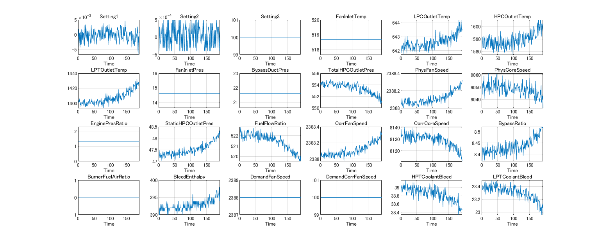
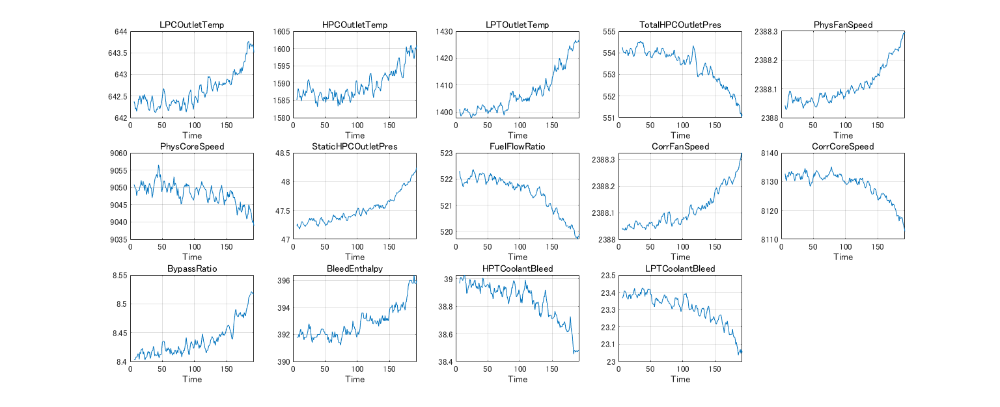
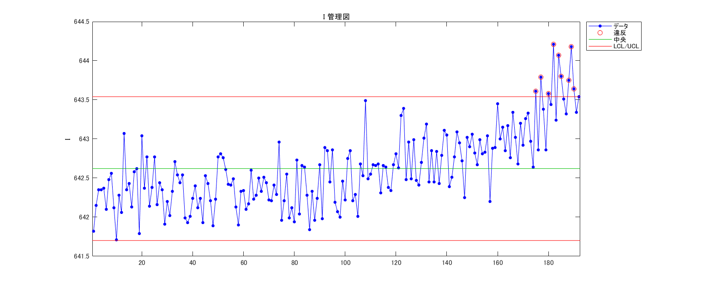
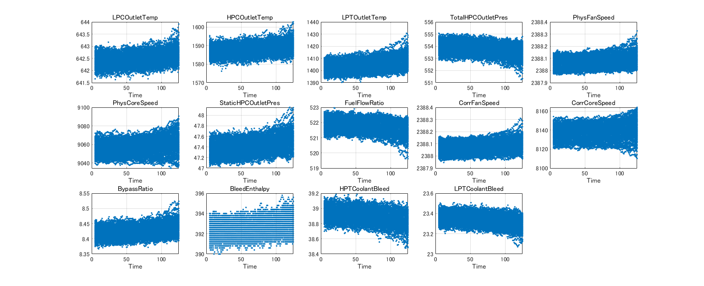
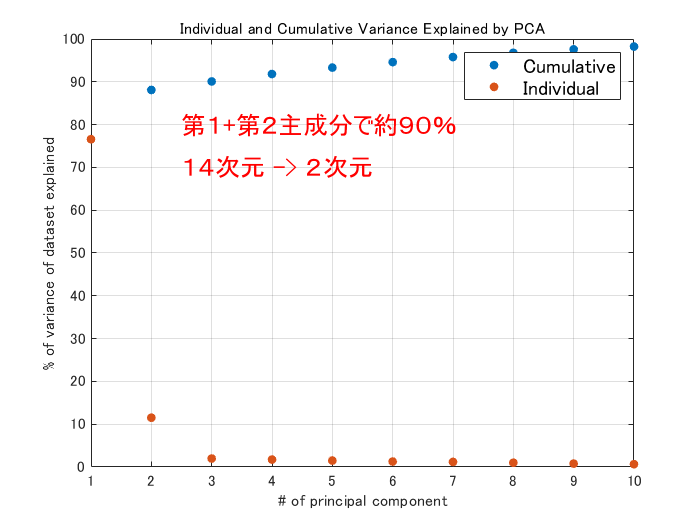
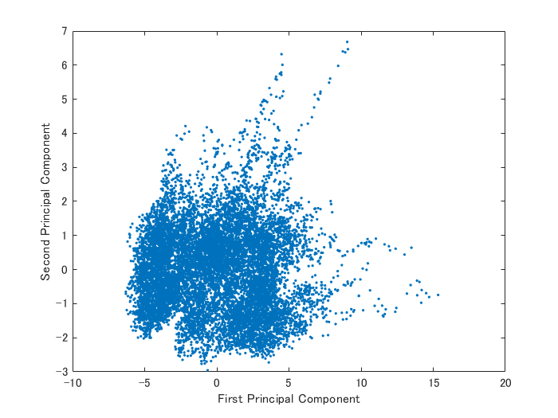
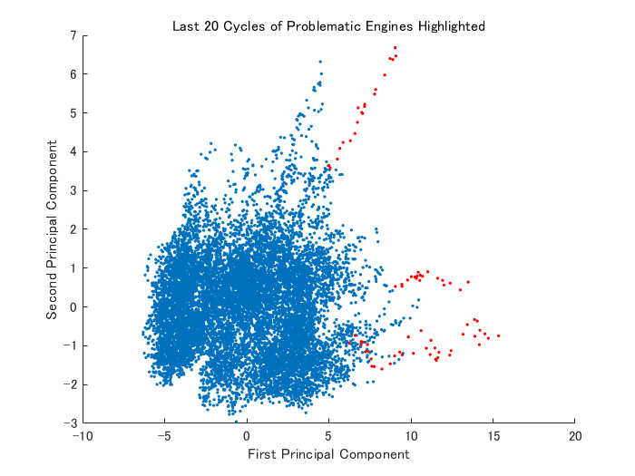
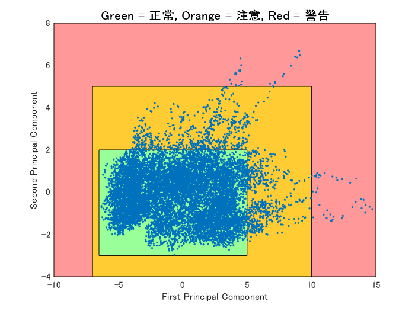

# 予測メンテナンスに向けた教師なし学習による解析


Copyright 2016-2021 The MathWorks, Inc.


故障が発生した場合の損失が甚大である場合、保守的なスケジュールで（より短い期間で）メンテナンスを行うことで、故障の発生を避けるアプローチはよく取られます。 ただこのアプローチでは結果として必要以上にメンテナンスを実施することに繋がることが多く、余計なコストとなります。 そこで機器の状態に応じたメンテナンス、故障が発生することが予知された場合にメンテナンスを実施する手法が重要となります。 


機械学習を用いた故障を予知するシステムを作るにあたって実際に故障が発生した際のデータがない場合には、次の２つの方法が考えられます。


   -  詳細な物理モデルを作成し故障の状態を発生させ、教師あり学習のワークフローに使用しうるデータを取得する。 
   -  教師なし学習を行い異常を検知し警告を発生するシステムを構築する。 


本スクリプトでは２つ目の手法をご説明します。Copyright 2015-2016 The MathWorks, Inc.


# 背景 (Story setup)


エンジン100機を購入しました。エンジンメーカーは 125 サイクル毎のメンテナンスを推奨していますが １回目のメンテナンスを実行した整備スタッフによると、39, 57, 70, 91 番のエンジンだけが実際にメンテナンスが 必要な状態であり、その他のエンジンは修理無しでも問題なく機能しただろうとのことでした。 すなわち必要がないにもかかわらずメンテナンスを行い、貴重なリソースを無駄にしてしまいました。 そこで、より効率のよくメンテナンスを行うために、メンテナンスが必要かどうかを判断する仕組みを作りたいと思います。


# 第１エンジンからのデータを読み込み (Read in first engine data)


機器から取得したセンサーデータを使用します。 実際にメンテナンスが必要かどうかにかかわらず、125 サイクルの後メンテナンスを 実行しているため、最初の 125 サイクル分のデータしかありません。 整備スタッフによると、いくつかのエンジンは実際にメンテナンスが必要だったが、 他のほとんどは問題がなく、実際に整備を行わずとも問題なく使用できていたとのこと。 また、今までのところメンテナンス実施前に故障が発生したことはありません。


```matlab:Code
sensorData = readtable('dataSet\train_FD001_Unit_1.csv','ReadVariableNames',true);
```

# センサーデータのプロット (Interactive visualizations to aid discovery)

```matlab:Code
figure('Name', 'Plot imported data', 'NumberTitle', 'off', 'Units', 'normalized', 'Position', [0.05, 0.25, 0.80, 0.58]);
for k = 1:24
    subplot(4,6,k); plot(sensorData.Time, sensorData{:,2+k})
    title(sensorData.Properties.VariableNames{2+k});
    xlabel('Time'); xlim([0, sensorData.Time(end)]); grid('on');
end
```




# プロットから判断し、関連のありそうな変数を選択します (Select relevant variable names based on visualization)

```matlab:Code
variableNames = {'Unit' 'Time' 'LPCOutletTemp' 'HPCOutletTemp', 'LPTOutletTemp' 'TotalHPCOutletPres' 'PhysFanSpeed' ...
    'PhysCoreSpeed' 'StaticHPCOutletPres' 'FuelFlowRatio', 'CorrFanSpeed' 'CorrCoreSpeed' 'BypassRatio'...
    'BleedEnthalpy' 'HPTCoolantBleed' 'LPTCoolantBleed'};
sensorData = sensorData(:, variableNames);
```

# ノイズを除去します (Remove noise)


センサーデータに対して移動平均フィルターを施します


```matlab:Code
smoothData = sensorData;
smoothData{:,3:end} = movmean(sensorData{:,3:end}, 5);
smoothData(1:5,:) = [];
```

# フィルター処理後のデータをプロットします (Plot smoothed data)

```matlab:Code
figure('Name', 'Plot filtered data', 'NumberTitle', 'off', 'Units', 'normalized', 'Position', [0.05, 0.25, 0.80, 0.58]);
for k = 1:14
    subplot(3,5,k); plot(smoothData.Time, smoothData{:,2+k})
    title(smoothData.Properties.VariableNames{2+k});
    xlabel('Time'); xlim([0, smoothData.Time(end)]); grid('on');
end
```




# 管理図


チャートでは、中央線 (CL) が平均値に、上下限の管理限界 (UCL、LCL) が中央線から 3σ の位置に、プロットされます。


```matlab:Code
controlchart(sensorData.LPCOutletTemp,'charttype','i')
```




# すべてのデータの読み込み Read all data

```matlab:Code
filenames = 'train_FD001_Unit_*';
files = [pwd '\dataSet\' filenames '.csv'];

ds = datastore(files,'TreatAsMissing','NA','Delimiter', ',',...
    'SelectedVariableNames',variableNames,'ReadSize','file');

dataAll = readall(ds);

smoothDataAll = [];
for n = 1:100
    tempData = dataAll(dataAll.Unit == n,:);
    tempData{:,3:end} = movmean(tempData{:,3:end}, 5);
    smoothDataAll = [smoothDataAll;tempData(5:125,:)]; %#ok
end
    
```

# すべてのデータをプロット Plot all data

```matlab:Code
figure('Name', 'Plot filtered data', 'NumberTitle', 'off', 'Units', 'normalized', 'Position', [0.05, 0.25, 0.80, 0.58]);
for k = 1:14
    subplot(3,5,k); plot(smoothDataAll.Time,smoothDataAll{:,2+k}, '.');
    title(smoothDataAll.Properties.VariableNames{2+k});
    xlabel('Time'); xlim([0, smoothDataAll.Time(end)]); grid('on');
end
```




# データを標準化 Standardize data


機械学習アルゴリズムはデータの単位などの概念はありません。 それぞれのセンサーからのデータは異なる単位やスケールをもつので まずデータを標準化し、平均を 0、標準偏差を 1 に揃えます。


```matlab:Code
Xtrain = smoothDataAll{:,3:end};
[XtrainStandard, XtrainMean, XtrainStd] = zscore(Xtrain);
```

# 主成分分析による次元の低減 Dimensionality Reduction - PCA

```matlab:Code
[coeff,score,latent] = pca(XtrainStandard);
```


それぞれの主成分により説明される変動と、説明される変動の累積和をプロットしますと、 ２つの主成分により約９０%の変動が説明されることがわかります。


```matlab:Code
figure;
plot([cumsum(latent(1:10))/sum(latent) latent(1:10)/sum(latent)]*100,'.','MarkerSize',18);
grid('on');
xlabel('# of principal component');
ylabel('% of variance of dataset explained');
legend({'Cumulative','Individual'},'FontSize',12)
title('Individual and Cumulative Variance Explained by PCA')
text(2.5,80,'第１+第２主成分で約９０％', 'FontSize',15,'Color','red');
text(2.5,70,'１４次元 -> ２次元', 'FontSize',15,'Color','red');
```





２つの主成分だけでデータをプロットします。


```matlab:Code
figure; plot(score(:,1),score(:,2),'.')
xlabel('First Principal Component');
ylabel('Second Principal Component');
```





新たなデータを標準化・そして同じ主成分に分解するために必要なデータを保存します。


```matlab:Code
save cordTrans coeff XtrainMean XtrainStd
```

# 警告システム Warning system


ここで、上記のデータを使って '正常' な状態から離脱したかどうかを判別する方法を見つけ出します。 一般的なアプローチとしては、機器の状態がデータが密集した領域にあれば'正常'、 そして密集した領域から離れた場合に '異常'、すなわちメンテナンスが必要である可能性があると判断する方法がとられます。 そうしますと、'正常' から '異常' へいつ遷移するかを判断する手法が必要になります。


# それぞれのエンジンのセンサーデータの、最初と最後の点を表示してみます Visualize first and last points for each engine


それぞれのエンジンから取得されたデータのうち、最初と最後の点だけをプロットしてみます。 もし主成分で分類した特定の領域からスタートし、そしてメンテナンスが実施されるまでの間に 他の領域に移動する傾向にある場合、故障を指し示す指標となるかもしれません。


このケースでは最初の点は原点近くに集まり、最後の点はそこから離れた点を中心にもち、 最初の点と最後の点はそれぞれ別のグループを形成することが見て取れます。 ただ、メンテナンス時に多くのエンジンが正常に機能していることを考えみると、 重なった領域が大きいことは不思議ではありません。


```matlab:Code
[~,idxEng] = unique(smoothDataAll.Unit);
idxEngLast = idxEng-1;
idxEngLast(idxEngLast < 1) = [];

% 中心を計算します
idxEngCent = [mean(score(idxEng,1)),mean(score(idxEng,2))];
idxEngLastCent = [mean(score(idxEngLast,1)),mean(score(idxEngLast,2))];

% 可視化
figure; hold('on');
plot(score(idxEng,1),score(idxEng,2),'.','MarkerSize',16)
plot(score(idxEngLast,1),score(idxEngLast,2),'r.','MarkerSize',16)
scatter(idxEngCent(1),idxEngCent(2),50,'g','^','filled')
scatter(idxEngLastCent(1),idxEngLastCent(2),50,'g','o','filled')
legend('First Points','Last Points','First Points Centroid','Last Points Centroid','Location','NorthWest');
xlabel('First Principal Component'); 
ylabel('Second Principal Component');
title('First (Sample 1) and Last (Sample 125) for Each Engine');
hold('off');
```


# 経過時間別にデータ点をグループ分けしてみます Group data points by time after initial use


先ほどのプロットでは最初と最後の点しか見ませんでしたが、今度は時系列的に２つの グループに分けてプロットしてきます。1 つは 100 サイクル以下、2 つは 101 サイクル以降のデータ点です。 最初と最後の点と同様に、データの前半と後半で異なる点を中心に分散していますが、重なりも大きいことがわかります。


```matlab:Code
% データを前半・後半に分割
earlyData = score(smoothDataAll.Time <= 100,1:2);
lateData = score(smoothDataAll.Time > 100,1:2);

% 中心を計算
EarlyCent = [mean(earlyData(:,1)),mean(earlyData(:,2))];
LateCent = [mean(lateData(:,1)),mean(lateData(:,2))];

figure;hold('on');
plot(earlyData(:,1),earlyData(:,2),'.')
plot(lateData(:,1),lateData(:,2),'r.')
scatter(EarlyCent(1),EarlyCent(2),50,'g','^','filled')
scatter(LateCent(1),LateCent(2),50,'g','o','filled')
legend('Early Points', 'Late Points', 'Early Centroid', 'Late Centroid','Location','Northwest')
xlabel('First Principal Component')
ylabel('Second Principal Component')
title('Early (Sample<100) and Late (Sample>=100) for Each Engine');
hold('off');
```


# 問題がありそうなエンジンをハイライト Highlight problematic engines


先ほどのプロットでは前半・後半のデータ点は大きく重なっていましたが、 幾つかのデータ点は明らかに中心から離れていることがわかります。 前述の整備スタッフからの報告でも、いくつかのエンジンだけは故障の兆候を確実に示していました。 それらのエンジンからのデータ点を色を変えて重ねてプロットしし、なにかわかりやすい傾向があるかを見てみます。


実際に表示してみますと、故障の兆候を示していたエンジンからのデータは、 確実に中心のクラスターから離れて行っており、クラスターから乖離しているかどうかが、 エンジンが修理が必要な状態になっているかどうかを判断するよい基準になるかもしれません。


```matlab:Code
idx = ismember(smoothDataAll.Unit,[39, 57, 70, 91]);
idx = idx & smoothDataAll.Time > (max(smoothDataAll.Time)-20); % only last 20 cycles
figure; hold('on');
plot(score(:,1),score(:,2),'.')
plot(score(idx,1),score(idx,2),'r.')
xlabel('First Principal Component')
ylabel('Second Principal Component')
title('Last 20 Cycles of Problematic Engines Highlighted');
hold('off')
```




# データ点の推移のアニメーション Animation of path through PCA


それぞれのエンジンの状態（データ点）がメンテナンスが実施された日に近づくにつれて 点群の中をどのように推移していくかをアニメーションで見てみます。（注： Live Editor 上ではアニメーションが動作せず最終結果しか表示されないので、代わりに >> Animation とスクリプトを実行してください）


```matlab:Code
% Engines identified by maintenance: [39, 57, 70, 91]
% EngineNum = 39;
% r = find(smoothDataAll.Unit == EngineNum);
% figure('Name', 'Animation of path through PCA', 'NumberTitle', 'off'); hold('on');
% LineAllH = plot(score(:,1),score(:,2),'.');
% LineEngH = plot(score(r(1),1), score(r(1),2),'g-','LineWidth',2);
% LineCurH = plot(score(r(1),1), score(r(1),2),'go','MarkerFaceColor','r');
% tiH = title(['Engine ' num2str(EngineNum) ' Sample 1']);
% xlabel('First Principal Component')
% ylabel('Second Principal Component')
% for n = 1:length(r)
%     set(LineEngH,'XData',score(r(1:n),1),'YData',score(r(1:n),2));
%     set(LineCurH,'XData',score(r(n),1),'YData',score(r(n),2));
%     tiH.String = ['Engine Number ' num2str(EngineNum) ' Sample ' num2str(n+4)];
%     pause(0.1);
% end
% hold('off')
```

# 注意や警告の信号を発する基準 Initial criteria for warning and alarm signals


今までの結果から '注意' や '警告' をいつ発するかの判断基準が何となくわかるかと思います。 すべてのエンジンのデータ点はメインのクラスタ付近から始まり、 メンテナンスが必要な状態に近づくにつれて、クラスタの外側に推移することがわかります。 そこで、'正常' な状態を逸脱してしまいメンテナンスの優先順位を高めるべき時に '注意' を発するとします。 このケースですとすべてのデータのうち 90% は '正常' の範囲に収まっています。 '警告' は '正常' な状態から大きく乖離し、今すぐにでもメンテナンスが必要な状態であるとします。 下記は '正常'/'注意'/'警告' それぞれの領域分割の初期推定値です。


この分割基準はあくまで初期推定値であり、メンテナンスを実施しつつ追加のセンサーデータや 整備スタッフからのフィードバックを集めつつ改善していくべきものとします。


```matlab:Code
idxAlarm = score(:,1) > 10 | score(:,1) < -7 | score(:,2) > 5 | score(:,2) < -4;
idxWarn = score(:,1) > 5 | score(:,1) < -6.5 | score(:,2) > 2 | score(:,2) < -3 & ~idxAlarm;
AlarmRegionVertices = [[-10, -4]; [-10, 8]; [15, 8]; [15, -4]; [-10,-4]];
WarningRegionVertices = [[-7, -4]; [-7, 5]; [10, 5]; [10, -4]; [-7, -4]];
NormalRegionVertices = [[-6.5, -3]; [-6.5, 2]; [5, 2]; [5, -3]; [-6.5, -3]];
    
figure; hold('on');
patch(AlarmRegionVertices(:,1), AlarmRegionVertices(:,2), [1, 0.6, 0.6]);
patch(WarningRegionVertices(:,1), WarningRegionVertices(:,2), [1, 0.8, 0.2]);
patch(NormalRegionVertices(:,1), NormalRegionVertices(:,2), [0.6,1, 0.6]);
plot(score(:,1),score(:,2),'.');  xlim([-10, 15])
title('Green = 正常, Orange = 注意, Red = 警告', 'FontSize', 12, 'FontWeight', 'bold');
xlabel('First Principal Component')
ylabel('Second Principal Component')
hold('off');
```





```matlab:Code
fprintf('\nPercent of points captured by ''normal'' conditions: %.1f%% \n',sum(~idxWarn)/length(score)*100)
```


```text:Output
Percent of points captured by 'normal' conditions: 89.8% 
```


```matlab:Code
fprintf('Percent of points captured by ''normal'' + ''warn'' conditions: %.1f%% \n',sum(~idxAlarm)/length(score)*100)
```


```text:Output
Percent of points captured by 'normal' + 'warn' conditions: 99.5% 
```

# 基準をどう評価するか How can we evaluate the criteria?


実際に故障した機器が無いので、故障時にどのようなデータとなるかはわかりません。 整備スタッフはいくつかのエンジンは故障の予兆を見つけており、 それらのエンジンからのデータは実際にメンテナンス日に近づくにつれて わかりやすい傾向を示していました。ただ、それでも故障発生にどれだけ 差し迫っていたかは知るよしがありません。この点は教師なし学習の難しい点となります。


では今回分析した情報をどのように意思決定に活かすことができるでしょう。 いくつかの戦略が考えられます。一つの保守的な戦略としては 少しずつ（例えば 5 サイクル）定期的なメンテナンスを遅らせていく方法があります。 例えば、初回のメンテナンスは 125 サイクルの後実施しますが、その次は '注意' の 信号が発せられない限りは 130 サイクル後にメンテナンスを実施します。もし '注意' の 状態となった場合には優先的にメンテナンスを行います。そうでない場合には 少しずづメンテナンスの実施を遅らせ、同時にセンサーデータや整備スタッフからの フィードバックを元に、'注意'/'警告' の基準を更新していくことができます。


上記の方法を繰り返し、定期的なメンテナンスの間隔を開けていき、最終的にメンテナンスは 機器が '注意' もしくは '警告' を発した場合のみに実施するようになります。


にもかかわらず万が一故障が発生した場合、そのデータを保存しておいてください。 実際の危機では、故障に至るまでのデータ、そして故障自体のデータはどちらも 非常に収集が難しく、同時に非常に価値があるものです。 データ内に見られる故障の理解が進めば、予測メンテナンスの精度はより良くなります。


# すべてのエンジンからのデータを評価してみます Evaluate all engines


100 機すべてのエンジンのデータを読み込み、'注意' / '警告' の推移を見ながら故障するまでのデータを調査してみます。 故障に近づくにつれて '正常'/'注意'/'警告' に分類されるエンジンの割合が変化していることがわかります。 すべてのエンジンにおいて故障の 26 サイクル前には '正常' の分類ではなくなっています。 そして故障にいたる 9 サイクル前までにはすべてのエンジンで '警告' の状態に移行しており、 すべてのエンジンは故障前に少なくとも 9 サイクル続けて '警告' の状態であることがわかります。


```matlab:Code
% すべてのデータを読み込み
load fullDataset
load cordTrans
% センサーデータの抽出と標準化
Xfull = fullDataset{:,3:end-1};
Xfull = (Xfull - repmat(XtrainMean,size(Xfull,1),1))./repmat(XtrainStd,size(Xfull,1),1);
% センサーデータを主成分座標系に写像
score = Xfull*coeff;
% それぞれの点を '正常'/'注意'/'警告' に分類
idxAlarm = score(:,1) > 10 | score(:,1) < -7 | score(:,2) > 5 | score(:,2) < -4;
idxWarn = (score(:,1) > 5 | score(:,1) < -6.5 | score(:,2) > 2 | score(:,2) < -3) & ~idxAlarm;
idxNorm = ~idxWarn & ~idxAlarm;
% 故障までに残された時間でグループ分けし、それぞれの時間で
% それぞれの分類に何％のエンジンが属すかを求めます。
[g,r] = findgroups(fullDataset.TimeToFail);
s = splitapply(@(n,w,a)[sum(n)/length(n),sum(w)/length(w),sum(a)/length(a)],idxNorm,idxWarn,idxAlarm,g);
% プロット表示
figure
hold on
plot(r,s(:,1),'g','LineWidth',2)
plot(r,s(:,2),'Color',[1 .8 0],'LineWidth',2)
plot(r,s(:,3),'r','LineWidth',2)
legend({'正常','注意','警告'},'Location','NorthWest','FontSize',14)
xlabel('故障までのフライト回数','FontSize',14)
ylabel('各カテゴリ割合','FontSize',14)
grid on
hold off
```


# 何サイクル稼いだか How much uptime did we gain?


もし今回構築した手法を、定期的なメンテナンスの代わりに実施した場合、 何サイクル追加で機器を稼働させられることができるでしょうか。 ここで '注意' / '警告' それぞれの状態になった時にメンテナンスを実施するケースを 検証し、定期メンテナンスとくらべてどれくらい追加で稼働させられたかを見てみます。


結果をみると '注意' の後にメンテナンスを実施した場合、そこまで変化はないことがわかります。 平均 2-3 サイクル余計に稼働させられる程度です。ただ、'警告' の状態まで メンテナンス実施を待った場合、平均 48 サイクル、約 40% 追加で稼働させられることがわかります。


```matlab:Code
% group by unit
ge = findgroups(fullDataset.Unit);
% 各エンジンについて '注意'/'警告' が発せられた点を探します。
sw = splitapply(@(x,y) min(x(y)),fullDataset.Time,idxWarn,ge);
sa = splitapply(@(x,y) min(x(y)),fullDataset.Time,idxAlarm,ge);
% デフォルトのメンテナンス計画で何サイクル稼働したか
defaultCycles = 125*100; % 125 cycles before maintenance * 100 engines
% '注意'/'警告' が発せられた時にメンテナンスを実行するという戦略で
% 何サイクル余計に稼働させられることができたかを計算
gainedCyclesWarn = sum(sw)-defaultCycles;
gainedCyclesAlarm = sum(sa)-defaultCycles;
fprintf('\nGain %.1f%% additional uptime by doing maintenance upon first Warning signal.\n',gainedCyclesWarn/defaultCycles*100)
```


```text:Output
Gain 1.2% additional uptime by doing maintenance upon first Warning signal.
```


```matlab:Code
fprintf('Gain %.1f%% additional uptime by doing maintenance upon first Alarm signal.\n',gainedCyclesAlarm/defaultCycles*100)
```


```text:Output
Gain 37.5% additional uptime by doing maintenance upon first Alarm signal.
```


```matlab:Code
maxCycles = length(idxAlarm) - defaultCycles - 100;
fprintf('Gain %.1f%% additional uptime by doing maintenance 1 sample before failure.\n',maxCycles/defaultCycles*100)
```


```text:Output
Gain 61.0% additional uptime by doing maintenance 1 sample before failure.
```


```matlab:Code
% 故障を発生する前に、'警告' を発していないエンジンは？
sna = splitapply(@(x) any(idxAlarm),idxAlarm,ge);
numalarmed = sum(sna == 0);
fprintf('Number of engines that did NOT trigger an alarm before failing: %.0f\n',numalarmed)
```


```text:Output
Number of engines that did NOT trigger an alarm before failing: 0
```

